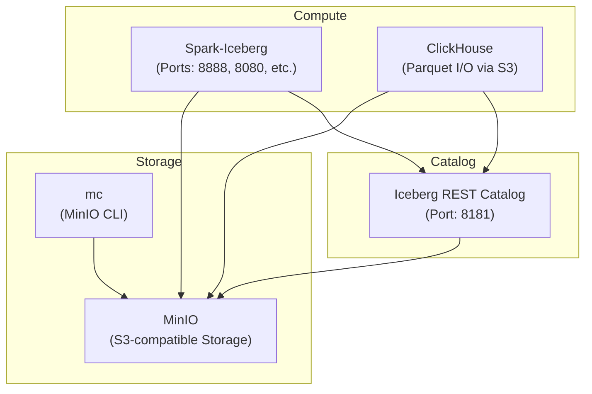
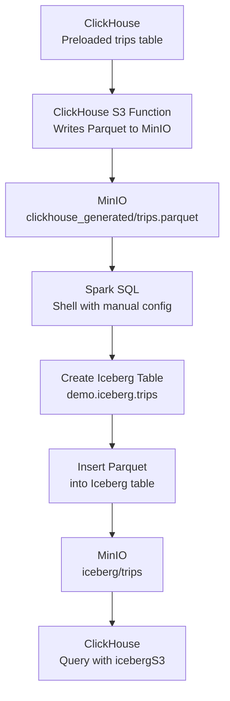

### Queries
Source: https://www.e6data.com/blog/iceberg-metadata-evolution-after-compaction

Note: This requires a bit more memory so it is advised to increase your colima/docker desktop memory limits.
```shell
colima start --cpu 6 --memory 12
```

### Docker Setup



#### Setup
Note: You can view the s3 directories and folders using minio ui
```shell
http://localhost:9001/login
username: admin
password: passwrod
```
All the commands from here on should be run from within the directory. If you are in a different directory, cd into the directory **end to end**.

```shell
# Run only if not the end to end directory
cd end to end
```

Once in the directory, grant executable permissions to setup.sh and teardown.sh

```shell
chmod +x ./setup.sh ./teardown.sh
```

### Setup Script Summary (`setup.sh`)

This script automates the setup of a local lakehouse environment with Spark, Iceberg, MinIO, ClickHouse, and a REST catalog.

**Key actions:**

- Creates required directories (`lakehouse`, `minio/data`, `notebooks`, etc.)
- Downloads NYC Taxi dataset (`trips_0`, `trips_1`, `trips_2`) and extracts it into ClickHouse's import directory
- Downloads necessary JARs for Spark to connect with S3 (Hadoop AWS and AWS SDK)
- Starts all services using Docker Compose
- Initializes the ClickHouse table and loads the dataset using `init-clickhouse.sh`

### ClickHouse Initialization Script Summary (`init-clickhouse.sh`)

This script is executed inside the ClickHouse container to:

- Wait for the ClickHouse server to be ready
- Create a `trips` table (NYC Taxi schema) with geolocation, fare, and trip info
- Import all `.tsv` dataset files from `/var/lib/clickhouse/data_import` into the `trips` table

The table uses the `MergeTree` engine with `pickup_datetime` and `dropoff_datetime` as the primary key.

### Teardown Script Summary (`teardown.sh`)

Use this script to clean up the entire lakehouse environment:

- Stops and removes all Docker containers and volumes
- Deletes local project directories:
  - `lakehouse/` (Iceberg data)
  - `minio/` (object store data)
  - `clickhouse/` (database files and import data)

## Flow 1: Moving Data from Clickhouse to Iceberg Tables



### Step 1: Data from clickhouse tables into S3 as a parquet file

Fire up clickhouse client

```shell
docker exec -it clickhouse clickhouse-client
```
The pre created **trips** table is within default database. We will write this table as a parquet file into s3 bucket.

```sql
INSERT INTO FUNCTION s3(
  'http://minio:9000/lakehouse/clickhouse_generated/trips.parquet',
  'admin', 'password',
  'Parquet'
)
SELECT * FROM trips;
```

This parquet file can be then queried using clickhouse itself.

Count of rows from parquet file
```sql
SELECT count(*) FROM s3('http://minio:9000/lakehouse/clickhouse_generated/trips.parquet','admin','password');
```
It should match the count of rows in trips table
```sql
SELECT count(*) from trips;
```

### Step 2: Creating iceberg table using this parquet file
Fire up spark sql: For some reason spark sql does not inherit the configurations passed 
as the env variables in docker compose file. Hence we are configuring the same here.

```shell
docker exec -it spark-iceberg spark-sql \
  --conf spark.driver.extraClassPath="/opt/spark-extra-jars/*" \
  --conf spark.executor.extraClassPath="/opt/spark-extra-jars/*" \
  --conf spark.hadoop.fs.s3a.access.key=admin \
  --conf spark.hadoop.fs.s3a.secret.key=password \
  --conf spark.hadoop.fs.s3a.endpoint=http://minio:9000 \
  --conf spark.hadoop.fs.s3a.path.style.access=true
```
Create table
```sql
CREATE TABLE demo.iceberg.trips (
                                       trip_id             INT,
                                       pickup_datetime     TIMESTAMP,
                                       dropoff_datetime    TIMESTAMP,
                                       pickup_longitude    DOUBLE,
                                       pickup_latitude     DOUBLE,
                                       dropoff_longitude   DOUBLE,
                                       dropoff_latitude    DOUBLE,
                                       passenger_count     INT,
                                       trip_distance       FLOAT,
                                       fare_amount         FLOAT,
                                       extra               FLOAT,
                                       tip_amount          FLOAT,
                                       tolls_amount        FLOAT,
                                       total_amount        FLOAT,
                                       payment_type        STRING,
                                       pickup_ntaname      STRING,
                                       dropoff_ntaname     STRING
) USING ICEBERG
PARTITIONED BY (
    payment_type
);
```

Insert into this iceberg table using parquet file ingested before
```sql
INSERT INTO demo.iceberg.trips
SELECT * FROM parquet.`s3a://lakehouse/clickhouse_generated/trips.parquet`;
```
You can query the count of rows using this spark sql query:
```sql
SELECT COUNT(*) FROM demo.iceberg.trips;
```

We will create another table called trips_unpartitioned for reference.

```sql
CREATE TABLE demo.iceberg.trips_unpartitioned (
                                       trip_id             INT,
                                       pickup_datetime     TIMESTAMP,
                                       dropoff_datetime    TIMESTAMP,
                                       pickup_longitude    DOUBLE,
                                       pickup_latitude     DOUBLE,
                                       dropoff_longitude   DOUBLE,
                                       dropoff_latitude    DOUBLE,
                                       passenger_count     INT,
                                       trip_distance       FLOAT,
                                       fare_amount         FLOAT,
                                       extra               FLOAT,
                                       tip_amount          FLOAT,
                                       tolls_amount        FLOAT,
                                       total_amount        FLOAT,
                                       payment_type        STRING,
                                       pickup_ntaname      STRING,
                                       dropoff_ntaname     STRING
) USING ICEBERG;
```
Insert into this iceberg table using parquet file ingested before
```sql
INSERT INTO demo.iceberg.trips_unpartitioned
SELECT * FROM parquet.`s3a://lakehouse/clickhouse_generated/trips.parquet`;
```

### Step 3: Querying iceberg tables from clickhouse

Fire up clickhouse client

```shell
docker exec -it clickhouse clickhouse-client
```

Turn on the experimental iceberg database 
```sql
set allow_experimental_database_iceberg=true;
```
Create a database for the same
```sql
CREATE DATABASE demo
ENGINE = DataLakeCatalog('http://rest:8181/v1', 'admin', 'password')
SETTINGS catalog_type = 'rest', storage_endpoint = 'http://minio:9000/lakehouse', warehouse = 'demo'
```

List tables in this:
```sql
show tables from demo;
```

Query this new table count

```sql
SELECT count(*) FROM demo.`iceberg.trips`;
```

You can also directly read the tables in s3 path bypassing the catalog all together.
```sql
SELECT count(*) FROM icebergS3('http://minio:9000/lakehouse/iceberg/trips','admin','password');
```
It should match the count of rows in trips table
```sql
SELECT count(*) from trips;
```

## Flow 2: Partition Pruning Using Clickhouse

Run the following query
```sql
 SELECT count(*) FROM demo.`iceberg.trips` WHERE payment_type = '3';
```

Since the table is partitioned on payment_type column, a suitable event would be emitted in query details.
Note the query id in response of above query and paste it in the query below.

```sql
 SELECT query_id, ProfileEvents['IcebergPartitionPrunedFiles'] as SkippedFiles, read_rows, read_bytes
 FROM system.query_log where query_id='<query-id>' and type='QueryFinish' order by event_time desc limit 1;
```
Note down the No of rows read and the number of bytes read for this.
Also note the Profile events and search for **IcebergPartitionPrunedFiles** event. 

You can run the same query on unpartitioned table and it will not have the above profile event.
```sql
 SELECT count(*) FROM demo.`iceberg.trips` WHERE payment_type = '3';
```

What is [IcebergPartitionPrunedFiles](https://github.com/ClickHouse/ClickHouse/blob/12a8efa30af8ec6a1e905017aa7a15e27af10833/src/Common/ProfileEvents.cpp#L232) ? 

IcebergPartitionPrunedFiles is a ClickHouse ProfileEvent counter that records the number of data files skipped during query planning or execution as a result of Iceberg partition pruning.


## FLOW 2: Schema Evolution

### Evolution 1: Adding a column

Fire up spark sql

```shell
docker exec -it spark-iceberg spark-sql \
  --conf spark.driver.extraClassPath="/opt/spark-extra-jars/*" \
  --conf spark.executor.extraClassPath="/opt/spark-extra-jars/*" \
  --conf spark.hadoop.fs.s3a.access.key=admin \
  --conf spark.hadoop.fs.s3a.secret.key=password \
  --conf spark.hadoop.fs.s3a.endpoint=http://minio:9000 \
  --conf spark.hadoop.fs.s3a.path.style.access=true
```

Add a column say driver notes to the trips table.
```sql
ALTER TABLE demo.iceberg.trips ADD COLUMN driver_notes STRING;
```

At this point your clickhouse client will be aware of the newly added column.
Run this in your clickhouse shell.
```sql
show table demo.`iceberg.trips`;
```

Now we will add a row with driver_notes using spark shell.
```sql
INSERT INTO demo.iceberg.trips VALUES
(99999, TIMESTAMP '2023-07-01 10:00:00', TIMESTAMP '2023-07-01 10:30:00', -73.985, 40.748, -73.985, 40.748, 1, 5.2, 18.0, 1.0, 3.0, 0.0, 22.0, 'CRE', 'Midtown', 'Uptown', 'Great driver');
```

You can confirm it in Spark:
```sql
SELECT trip_id, driver_notes FROM demo.iceberg.trips WHERE trip_id = 99999;
```

You can also read this from Clickhouse:
```sql
select * from demo.`iceberg.trips` where trip_id=99999 format VERTICAL;
```

Note if you run the same command for a different trip: 
```sql
select * from demo.`iceberg.trips` where trip_id=1200853689 format VERTICAL;
```
The driver_notes column will be NULL.

### Evolution 2: Renaming A Column:

Let's rename the driver_notes column to feedback in Spark shell:
```sql
ALTER TABLE demo.iceberg.trips RENAME COLUMN driver_notes TO feedback;
```

At this point clickhouse will be aware of the newly added column.
Run this in your clickhouse client.
```sql
show table demo.`iceberg.trips`;
```
You can also read this from Clickhouse:
```sql
select * from demo.`iceberg.trips` where trip_id=99999 format VERTICAL;
```

### Evolution 3: Deleting A Column:

Let's drop the feedback column using spark shell:
```sql
ALTER TABLE demo.iceberg.trips DROP COLUMN feedback;
```

At this point clickhouse will be aware of the newly added column.
Run this in your clickhouse client.
```sql
show table demo.`iceberg.trips`;
```
You can also read this from Clickhouse Client:
```sql
select * from demo.`iceberg.trips` where trip_id=99999 format VERTICAL;
```

### Evolution 4: Updating A Column Type:

Iceberg enforces safe schema evolution, meaning:

1. You can change from int → long, or float → double (widening).
2. You cannot change from string → int (incompatible).
3. You cannot cast down (e.g., double → float or long → int).

These rules are enforced at the catalog level, using Iceberg's schema resolution rules.

Let's try to cast a column passenger_count int to double. 

```sql
ALTER TABLE demo.iceberg.trips ALTER COLUMN passenger_count TYPE DOUBLE;
```

This will not succeed and you will be met with an error.

Before changing type of passenger_count to LONG, let's note the current column type in clickhouse client:  

```sql
 show table demo.`iceberg.trips`;
```
The type is  `passenger_count` Nullable(Int32)

Now let's update the column type using Spark:
```sql
ALTER TABLE demo.iceberg.trips ALTER COLUMN passenger_count TYPE LONG;
```

Let's view the same in Clickhouse client now:
```sql
 show table demo.`iceberg.trips`;
```
The type is  `passenger_count` Nullable(Int64)


## FLOW 4: Time Travel

Let's insert another row using Spark Shell:
```sql
INSERT INTO demo.iceberg.trips VALUES
  (99999, TIMESTAMP '2023-07-01 10:00:00', TIMESTAMP '2023-07-01 10:30:00', -73.985, 40.748, -73.985, 40.748, 1, 5.2, 18.0, 1.0, 3.0, 0.0, 22.0, 'CASH', 'Midtown', 'Uptown');
```

Now let's query the latest snapshot from clickhouse client:
```sql
select * from demo.`iceberg.trips` where trip_id=99999 format VERTICAL;
```

This will return 2 rows.

Let's travel back in time and try to query that snapshot.

On your spark shell, fire this query to get snapshots ids.
```sql
SELECT snapshot_id, committed_at, operation FROM demo.iceberg.trips.snapshots;
```

Now on clickhouse, let's use the latest snapshot id and fire a query:
```sql
SELECT * FROM demo.`iceberg.trips` WHERE trip_id = 99999 SETTINGS iceberg_snapshot_id = <snapshot-id-here>;
```

### Using timestamp instead of Snapshot ids
Clickhouse also support iceberg_timestamp_ms setting as well.

Find the committed time from spark sql:
```sql
SELECT snapshot_id, committed_at, operation FROM demo.iceberg.trips.snapshots;
```
Download the latest metadata file from minio ui, and inspect the metadata file for timestamp.

```sql
SELECT * FROM demo.`iceberg.trips` WHERE trip_id = 99999 SETTINGS iceberg_timestamp_ms = <timestamp-here> format vertical;
```

This shows you can traverse the snapshots using clickhouse.

Note: If you alter columns in between, clickhouse will not be aware of that.
You can add the driver_notes column again, and see if it shows up.

Spark sql :
```sql
ALTER TABLE demo.iceberg.trips ADD COLUMN driver_notes STRING;
```
Clickhouse sql:
```sql
 SELECT * FROM demo.`iceberg.trips` WHERE trip_id = 99999 SETTINGS iceberg_snapshot_id = <snapshot id> format vertical;
```
