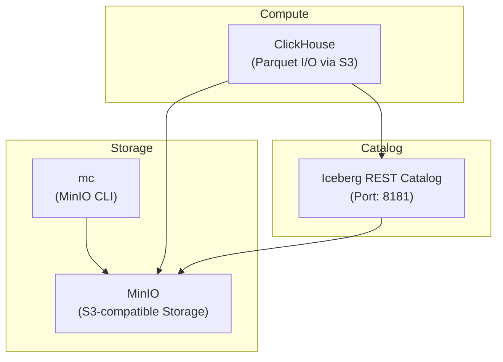

### Queries
Source: https://www.e6data.com/blog/iceberg-metadata-evolution-after-compaction

Note: This requires a bit more memory so it is advised to increase your colima/docker desktop memory limits.
```shell
colima start --cpu 6 --memory 12
```

### Docker Setup



#### Setup
Note: You can view the s3 directories and folders using minio ui
```shell
http://localhost:9003/login
username: minio
password: ClickHouse_Minio_P@ssw0rd
```

All the commands from here on should be run from within the directory. If you are in a different directory, cd into the directory **end to end**.
```shell
# Run only if not the end to end directory
cd end to end
```

Once in the directory, grant executable permissions to setup.sh and teardown.sh
```shell
chmod +x ./setup.sh ./teardown.sh
```

### Note:
We have added a clickhouse binary picked from here: https://github.com/ClickHouse/ClickHouse/actions/runs/16633452096/job/47075099557
You can download the binary which works for your platform.
Eg: arm_binary works on apple silicon.

Download the binary, and place it in clickhouse_binary folder before proceeding with the poc. You can decompress the binary by running ./clickhouse --version command.

### Setup Script Summary (`setup.sh`)

This script automates the setup of a local environment with MinIO, Clickhouse, and a REST catalog.

**Key actions:**

- Creates required directories (`minio/data`,`cickhouse_data`, etc.)
- Starts all services using Docker Compose
- Starts the latest clickhouse binary, don't close the shell or the server is killed.

### Teardown Script Summary (`teardown.sh`)

Use this script to clean up the entire lake house environment:
- Before teardown, make sure you kill the ch server initiated using setup.sh (just ctrl + c on the setup.sh terminal)
- Stops and removes all Docker containers and volumes
- Deletes local project directories:
    - `minio/` (object store data)
    - `clickhouse_data/` (database files and import data)

## Flow 1: Moving Data from Clickhouse to Iceberg Tables

### Step 1: Creating iceberg table on object store using new clickhouse writes
Fire up spark sql: For some reason spark sql does not inherit the configurations passed
as the env variables in docker compose file. Hence we are configuring the same here.


### Step 2: Data from clickhouse tables into created table.

Fire up clickhouse client (Navigate to clickhouse_data directory so we use the latest client)

```shell
cd ./clickhouse_data
./clickhouse client
```

Allow experimental writes and experimental iceberg database:
```sql
set allow_experimental_insert_into_iceberg=true;
set allow_experimental_database_iceberg=true;
set write_full_path_in_iceberg_metadata=true;
```

Create a database with DatalakeCatalog engine:
```sql
CREATE DATABASE demo ENGINE = DataLakeCatalog('http://localhost:8189/v1', 'minio', 'ClickHouse_Minio_P@ssw0rd') 
SETTINGS catalog_type='rest',warehouse='demo',storage_endpoint='http://localhost:9002/warehouse-rest';
```

We will now insert to this table using clickhouse IcebergS3 engine.
```sql
CREATE TABLE demo.`iceberg.trips` (
                                    trip_id             INT,
                                    pickup_datetime     TIMESTAMP,
                                    dropoff_datetime    TIMESTAMP,
                                    pickup_longitude    DOUBLE,
                                    pickup_latitude     DOUBLE,
                                    dropoff_longitude   DOUBLE,
                                    dropoff_latitude    DOUBLE,
                                    passenger_count     INT,
                                    trip_distance       FLOAT,
                                    fare_amount         FLOAT,
                                    extra               FLOAT,
                                    tip_amount          FLOAT,
                                    tolls_amount        FLOAT,
                                    total_amount        FLOAT,
                                    payment_type        String,
                                    pickup_ntaname      String,
                                    dropoff_ntaname     String
) ENGINE=IcebergS3('http://localhost:9002/warehouse-rest/iceberg/trips/', 'minio', 'ClickHouse_Minio_P@ssw0rd') 
SETTINGS storage_catalog_type='rest',storage_warehouse='demo',storage_region='us-east-1',storage_catalog_url='http://localhost:8189/v1'
```

```sql
INSERT INTO demo.`iceberg.trips` FORMAT Values
(1002,'2023-01-15 09:00:00','2023-01-15 09:22:00',-73.99,40.75,-73.98,40.73,1,3.2,12.0,0.5,1.5,0.0,14.0,'CSH','MIDTOWN','SOHO'),
(1003,'2023-01-15 10:10:00','2023-01-15 10:40:00',-73.98,40.76,-73.97,40.72,3,6.0,20.0,0.5,2.5,0.0,23.0,'CRE','UPPER EAST','TRIBECA');
```

## Time Travel using iceberg snapshots

We inserted two rows above. Let's insert more rows now.
```sql
INSERT INTO demo.`iceberg.trips` FORMAT Values
(1003,'2023-01-15 09:00:00','2023-01-15 09:22:00',-73.99,40.75,-73.98,40.73,1,3.2,12.0,0.5,1.5,0.0,14.0,'CSH','MIDTOWN','SOHO'),
(1004,'2023-01-15 10:10:00','2023-01-15 10:40:00',-73.98,40.76,-73.97,40.72,3,6.0,20.0,0.5,2.5,0.0,23.0,'CRE','UPPER EAST','TRIBECA');
```

Now let's query the latest snapshot from clickhouse client:
```sql
select count(*) from demo.`iceberg.trips`;
```

This will return 4 rows.

Let's travel back in time and try to query that snapshot.

One way to find the snapshot id is to download the metadata file from your object store.
Login to the minio browser:
```shell
http://localhost:9003/login
username: minio
password: ClickHouse_Minio_P@ssw0rd
```

Navigate to warehouse-rest/iceberg/trips and download the latest metadata.json file. It will contain all the snapshots.

Now on clickhouse, let's use the latest snapshot id and fire a query:
```sql
SELECT count(*) FROM demo.`iceberg.trips` SETTINGS iceberg_snapshot_id = <snapshot-id-here>;
```
As you can see, for an older snapshot, the count is 2.

Note: iceberg_timestamp_ms is also a setting but it doesn't work with IcebergS3 table engines.