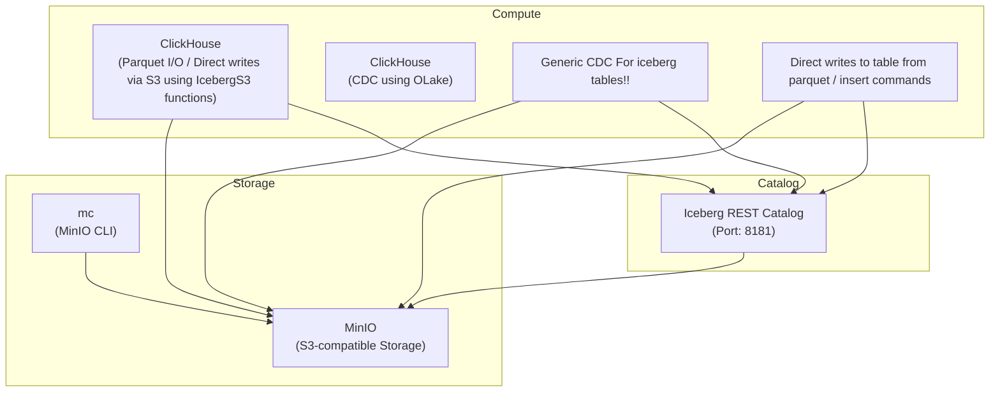

Note: This requires a bit more memory so it is advised to increase your colima/docker desktop memory limits.
```shell
colima start --cpu 6 --memory 15
```

### Docker Setup



#### Setup
Note: You can view the s3 directories and folders using minio ui
```shell
http://localhost:9003/login
username: minio
password: ClickHouse_Minio_P@ssw0rd
```

All the commands from here on should be run from within the directory. If you are in a different directory, cd into the directory **end to end**.
```shell
# Run only if not the end to end directory
cd clickhouse_writes
```

Once in the directory, grant executable permissions to setup.sh and teardown.sh
```shell
chmod +x ./setup.sh ./teardown.sh ./init-clickhouse.sh
```

### Note on clickhouse:
We have added a clickhouse binary picked from here: https://github.com/ClickHouse/ClickHouse/actions/runs/16633452096/job/47075099557
You can download the binary which works for your platform.
This is because the features are experimental and no docker image is available for very recent prs.
Eg: arm_binary works on apple silicon.

Download the binary, and place it in clickhouse_binary folder before proceeding with the poc. You can decompress the binary by running ./clickhouse --version command.

### Setup Script Summary (`setup.sh`)

This script automates the setup of a local environment with MinIO, Clickhouse, and a REST catalog.

**Key actions:**

- Creates required directories (`minio/data`,`cickhouse_data`, etc.)
- Starts all services using Docker Compose
- Starts the latest clickhouse binary, don't close the shell or the server is killed.

### Teardown Script Summary (`teardown.sh`)

Use this script to clean up the entire lake house environment:
- Before teardown, make sure you kill the ch server initiated using setup.sh (just ctrl + c on the setup.sh terminal)
- Stops and removes all Docker containers and volumes
- Deletes local project directories:
    - `minio/` (object store data)
    - `clickhouse_data/` (database files and import data)

### Setup clickhouse Script Summary (`init-clickhouse.sh`)

- This loads a weather dataset into clickhouse as a table. We will use this for further demo. 


### There are multiple write patterns which we will explore one by one.

### Step 1: Firing up the setup

```shell
# Run only if not the clickhouse_writes directory
cd clickhouse_writes
```

Run the setup script.
```shell
./setup.sh
```
Note: Running clickhouse in daemon causes issues with clickhouse data directory. 

Open a new terminal and navigate to clickhouse_writes folder and then preload the weather table to clickhouse.
```shell
./init-clickhouse.sh
```

Once this is done,  we can verify the count of rows in the table.
```shell
./clickhouse_data/clickhouse client --query "select count(*) from weather"
```

### Step 2: Creating the iceberg table:

As of version 25.7, clickhouse has introduced the ability to write and create clickhouse tables. 

Start the clickhouse client.
```shell
./clickhouse_data/clickhouse client
```

Allow experimental writes and experimental iceberg database:
```sql
set allow_experimental_insert_into_iceberg=true;
set allow_experimental_database_iceberg=true;
set write_full_path_in_iceberg_metadata=true;
```

Create a database with DataLakeCatalog engine: DataLakeCatalog is a database engine that helps us with reading of clickhouse tables. 
```sql
CREATE DATABASE demo ENGINE = DataLakeCatalog('http://localhost:8189/v1', 'minio', 'ClickHouse_Minio_P@ssw0rd') 
SETTINGS catalog_type='rest',warehouse='demo',storage_endpoint='http://localhost:9002/warehouse-rest';
```

We will now create a fresh table in this demo database using IcebergS3 table engine. Which will be used for writes.
```sql
CREATE TABLE demo.`weather.weather` (
    date_full        Nullable(String),
    date_month       Nullable(Int32),
    date_week_of     Nullable(Int32),
    date_year        Nullable(Int32),
    id               Nullable(Int32),
    precipitation    Nullable(Float32),
    station_city     Nullable(String),
    station_code     Nullable(String),
    station_location Nullable(String),
    station_state    Nullable(String),
    temperature_avg  Nullable(Float32),
    temperature_max  Nullable(Float32),
    temperature_min  Nullable(Float32),
    wind_direction   Nullable(Int32),
    wind_speed       Nullable(Float32)
)  ENGINE=IcebergS3('http://localhost:9002/warehouse-rest/weather/weather/', 'minio', 'ClickHouse_Minio_P@ssw0rd') 
SETTINGS storage_catalog_type='rest',storage_warehouse='demo',storage_region='us-east-1',storage_catalog_url='http://localhost:8189/v1'
```

Verify if the database exists. Using the following: 
```sql
show tables in demo;
```

To test if inserts work, we are going to insert a single row in the table. 

```sql
INSERT INTO demo.`weather.weather` FORMAT Values ('2023-01-15',1,2,2023,1001,12.5,'New York','NYC01','40.7128,-74.0060','NY',5.6,8.2,3.1,180,12.3);
```

This showcases the ability of clickhouse to insert to iceberg tables directly.

This also means we can stream the weather table we created earlier during setup, to our iceberg table.
```sql
INSERT INTO demo.`weather.weather` (id,precipitation,date_full,date_month,date_week_of,date_year,station_city,station_code,station_location,station_state,temperature_avg,temperature_max,temperature_min,wind_direction,wind_speed)
SELECT id,precipitation,date_full,date_month,date_week_of,date_year,station_city,station_code,station_location,station_state,temperature_avg,temperature_max,temperature_min,wind_direction,wind_speed
FROM weather;
```

You can verify the count using :
```sql
select count(*) from demo.`weather.weather`;
```

### Step 2: Exporting ch table data as a parquet to s3. Then using spark to add the data to ch table.

```sql
INSERT INTO FUNCTION s3(
  'http://localhost:9002/warehouse-rest/clickhouse_generated/weather.parquet',
  'minio', 'ClickHouse_Minio_P@ssw0rd',
  'Parquet'
)
SELECT
  id,
  precipitation,
  date_full,
  toInt32(date_month) as date_month,
  toInt32(date_week_of) as date_week_of,
  toInt32(date_year) as date_year,
  station_city,
  station_code,
  station_location,
  station_state,
  temperature_avg,
  temperature_max,
  temperature_min,
  toInt32(wind_direction) as wind_direction,
  wind_speed
FROM weather;
```

This parquet file can be then queried using clickhouse itself.

Count of rows from parquet file
```sql
SELECT count(*) FROM s3('http://localhost:9002/warehouse-rest/clickhouse_generated/weather.parquet','minio','ClickHouse_Minio_P@ssw0rd');
```
It should match the count of rows in trips table
```sql
SELECT count(*) from weather;
```
Now that the data is present in existing s3 buckets, we can use spark to write these. 
This also showcases interoperability between multiple engines.

Exit from clickhouse client and fire up spark shell.

```shell
docker exec -it spark-iceberg spark-sql \
--conf spark.driver.extraClassPath="/opt/spark-extra-jars/*" \
--conf spark.executor.extraClassPath="/opt/spark-extra-jars/*" \
--conf spark.hadoop.fs.s3a.access.key=minio \
--conf spark.hadoop.fs.s3a.secret.key=ClickHouse_Minio_P@ssw0rd \
--conf spark.hadoop.fs.s3a.endpoint=http://minio:9000 \
--conf spark.hadoop.fs.s3a.path.style.access=true
```

We will write to the same table demo.weather.weather using this parquet.
```sql
INSERT INTO demo.weather.weather (date_full,date_month,date_week_of,date_year,id,precipitation,station_city,station_code,station_location,station_state,temperature_avg,temperature_max,temperature_min,wind_direction,wind_speed)
SELECT
  date_full,date_month,date_week_of,date_year,CAST(id AS INT) as id,precipitation,station_city,station_code,station_location,station_state,temperature_avg,temperature_max,temperature_min,wind_direction,wind_speed
FROM parquet.`s3a://warehouse-rest/clickhouse_generated/weather.parquet`;
```

Verify the count from clickhouse client:
```sql
select count(*) from demo.`weather.weather`;
```

### Step 3: Writing to the same table using OLAKE connectors.

Now that we have showcased writing to the same iceberg table using both clickhouse and spark. Let's look at another way of writing to the table.
Using Olake connectors.
[Olake](https://github.com/datazip-inc/olake) is an open source tool for replicating databases to apache iceberg.

When we fired up the setup.sh script, it created a mysql container with a weather database. With the same schema as the one created above.

We wil be using the steps mentioned in the [OLAKE example](https://github.com/datazip-inc/olake/blob/master/examples/README.md) here.

1.  Log in to the Olake UI at `http://localhost:8000` using the default credentials.

2.  **Create and Configure a Job:**
    Create a Job to define and run the data pipeline:
  * On the main page, click on the **"Create your first Job"** button.

  * **Set up the Source:**
    * **Connector:** `MySQL`
    * **Version:** chose the latest available version
    * **Name of your source:** `olake_mysql`
    * **Host:** `host.docker.internal`
    * **Port:** `3306`
    * **Database:** `weather`
    * **Username:** `root`
    * **Password:** `password`

  * **Set up the Destination:**
    * **Connector:** `Apache Iceberg`
    * **Catalog:** `REST catalog`
    * **Name of your destination:** `olake_iceberg`
    * **Version:** chose the latest available version
    * **Iceberg REST Catalog URL:** `http://host.docker.internal:8189`
    * **Iceberg S3 Path (example):** `s3://warehouse-rest/weather/`
    * **Iceberg Database (example):** `weather`
    * **S3 Endpoint (for Iceberg data files written by Olake workers):** `http://host.docker.internal:9002`
    * **AWS Region:** `us-east-1`
    * **S3 Access Key:** `minio`
    * **S3 Secret Key:** `ClickHouse_Minio_P@ssw0rd`
    * Make sure you disable identifier fields. Those are required for clickhouse equality deletes. Not necessary for this demo.

  * **Select Streams to sync:**
    * Select the weather table using checkbox to sync from Source to Destination.
    * Click on the weather table and set Normalisation to `true` using the toggle button.

  * **Configure Job:**
    * Set job name and replication frequency.

  * **Save and Run the Job:**
    * Save the job configuration.
    * Run the job manually from the UI to initiate the data pipeline from MySQL to Iceberg by selecting **Sync now**.


Once the data is synced, we can read it from other engines. Fire up your clickhouse client. 
```shell
./clickhouse_data/clickhouse client
```

And you can read / query these newly inserted rows as well.
```sql
select count(*) from demo.`weather.weather`;
```

### Extras:

With the DatalakeCatalog engine, clickhouse supports reading snapshots. We can make time travel queries on our table.

Fire up your spark sql to find different snapshot ids we can query.
```shell
docker exec -it spark-iceberg spark-sql \
--conf spark.driver.extraClassPath="/opt/spark-extra-jars/*" \
--conf spark.executor.extraClassPath="/opt/spark-extra-jars/*" \
--conf spark.hadoop.fs.s3a.access.key=minio \
--conf spark.hadoop.fs.s3a.secret.key=ClickHouse_Minio_P@ssw0rd \
--conf spark.hadoop.fs.s3a.endpoint=http://minio:9000 \
--conf spark.hadoop.fs.s3a.path.style.access=true
```

```sql
SELECT snapshot_id, committed_at, operation FROM demo.weather.weather.snapshots;
```

Once you have those snapshot ids, you can query the iceberg table till that snapshot using the following: 
```sql
 select count(*) from demo.`weather.weather` settings iceberg_snapshot_id=<snapshot-id-here>;
```

Once done, teardown the setup using
```shell
./teardown.sh
```